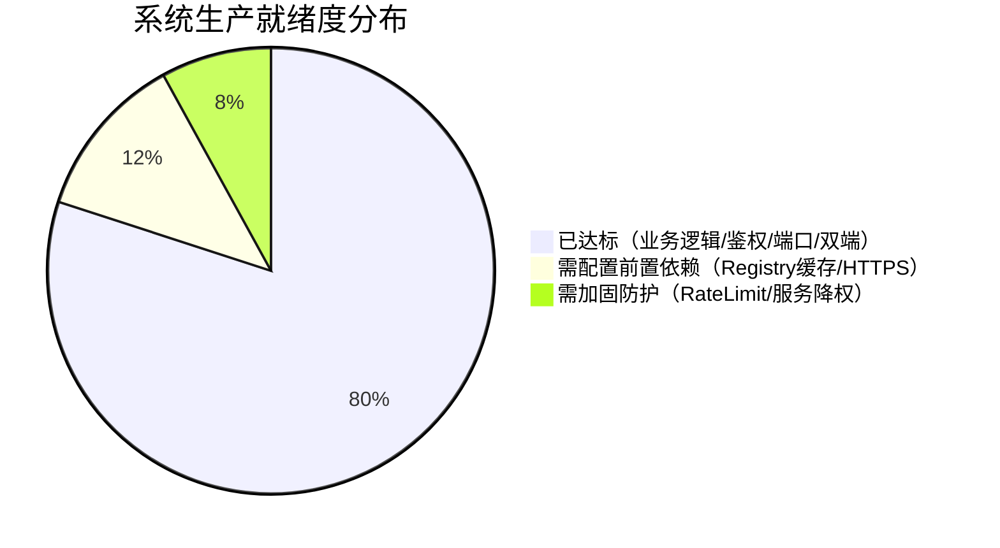

# dn42-portal 生产环境部署就绪度与安全隐患评估报告

> **报告版本**：2.0.0-prod-eval  
> **评估时间**：2026-09-04  
> **评估对象**：`AkiLab DN42 Peering Portal 2.0`（Node.js 服务端 + WASM Linux 终端 + React Web GUI 双前端 + 探针模块）  
> **代码基线**：第十九轮完整迭代通过状态（84/84 项单元与集成测试绿灯）

---

## 目录

1. [评估总览与就绪度裁定](#一评估总览与就绪度裁定)
2. [已具备生产能力的核心模块](#二已具备生产能力的核心模块)
3. [🔴 生产环境阻断级隐患与高危风险](#三-生产环境阻断级隐患与高危风险)
   - [3.1 DN42 注册表缓存为空，陌生用户无法通过 SSH 首次登入](#31-dn42-注册表缓存为空陌生用户无法通过-ssh-首次登入)
   - [3.2 缺乏接口限流，存在 Scrypt 计算密集型 DoS 风险](#32-缺乏接口限流存在-scrypt-计算密集型-dos-风险)
   - [3.3 生产环境依赖宿主机 `ssh-keygen` 工具链](#33-生产环境依赖宿主机-ssh-keygen-工具链)
   - [3.4 WASM 网页终端对 HTTPS 与安全响应头的强依赖](#34-wasm-网页终端对-https-与安全响应头的强依赖)
4. [🟡 架构与运维层面的潜在隐患](#四-架构与运维层面的潜在隐患)
   - [4.1 单机 JSON 文件存储限制了多进程/集群扩容](#41-单机-json-文件存储限制了多进程集群扩容)
   - [4.2 Systemd 服务以 root 身份运行的特权风险](#42-systemd-服务以-root-身份运行的特权风险)
   - [4.3 日志文件缺乏轮转（Logrotate）](#43-日志文件缺乏轮转logrotate)
   - [4.4 Telegram API 网络连通性与消息静默丢失风险](#44-telegram-api-网络连通性与消息静默丢失风险)
5. [生产环境部署前必检清单（Pre-Flight Checklist）](#五生产环境部署前必检清单pre-flight-checklist)
6. [推荐生产部署拓扑与实操指南](#六推荐生产部署拓扑与实操指南)

---

## 一、评估总览与就绪度裁定

### 综合评级：`B+`（业务流完备，需前置运维配置后方可上线）



| 评估维度 | 评级 | 现状说明 |
|---|:---:|---|
| **业务契约与核心逻辑** | 🟢 **A** | 会话增删改、端口自适应分配、同公钥避让、TG 模板均闭环并通过全量测试 |
| **数据持久化与一致性** | 🟢 **A-** | `FileStore` 具备单进程文件锁队列与原子重命名，单实例下安全可靠 |
| **网络与探针运维** | 🟢 **A-** | 探针专属 Token + Dark Secret 鉴权，支持无凭据安装与心跳续期 |
| **对外安全防御与防爆破** | 🟡 **B-** | 缺失针对 Scrypt 与 Looking Glass 接口的 IP 速率限制，存在 DoS 敞口 |
| **注册表数据链路** | 🔴 **C** | `registry_cache.json` 目前为空，未配置外部 DN42 注册表同步流水线 |
| **生产配置与环境依赖** | 🟡 **B** | 依赖宿主机 `ssh-keygen`，且必须配合 Caddy/Nginx HTTPS 反代输出 COOP/COEP |

---

## 二、已具备生产能力的核心模块

1. **单源权威规则（Single Source of Truth）**：
   - 端口分配（我方监听 `20000 + (asn % 10000)`、对方监听 `23143`、碰撞自动 `+10000` 避让）；
   - 规则层在 Node.js、客户端 Shell（`rules.sh`）与数据校验器中 100% 同步，无双端规则漂移。
2. **多节点探针专属授权模型**：
   - `dnp probe <NODE_ID>` 生成专属 64 位 Hex Token；
   - 节点仅依靠自身 WireGuard 私钥推导公钥完成登记，**私钥永不出节点**，彻底废弃了全局 Token 风险。
3. **双前端（WASM Linux CLI + Web GUI）**：
   - WASM Linux 终端支持免安装完整 CLI 交互，会话编辑支持文本参数（`peer edit JP-7`）；
   - Web GUI 与后端持久层状态实时双向对齐，编辑模式具备专属提示横幅与表单反填。
4. **单进程高并发数据安全性**：
   - 所有 JSON 文件写操作均接入基于 Promise 的单文件互斥排队队列（`FileStore.writeJson`），写入时采用 `.tmp` 文件写入并原子替换（Atomic Rename），彻底防止由于并发写导致的文件损坏。

---

## 三、🔴 生产环境阻断级隐患与高危风险

### 3.1 DN42 注册表缓存为空，陌生用户无法通过 SSH 首次登入
- **位置**：`server/data/registry_cache.json`、`server/services/authService.js:230-237`
- **机理与影响**：
  - 外部陌生 DN42 会员初次登入门户时，系统要求通过 `ssh-keygen -Y sign` 对 Challenge 进行数字签名；
  - 后端在校验签名之前，强制执行 `await this.getAsnRegistryInfo(cleanAsn)` 从 `registry_cache.json` 中查找该 ASN 绑定的 SSH 公钥（`authKeys`）；
  - **现状是该文件仅为 `{}`**。如果此时陌生用户尝试登入，后端会因找不到公钥而报错：
    ```text
    No SSH public keys registered in DN42 registry for AS424242xxxx
    ```
    造成首次使用者全面被拒，必须管理员人工预先在 `auth_users.json` 中塞入密码才能登录。
- **排查依据**：
  - 目前代码库中仅有读取与查询逻辑，**尚未包含自动克隆或拉取官方 `git clone https://git.dn42.dev/dn42/registry` 的脚本**。
- **解决方案**：
  - 暂定。


---

### 3.2 缺乏接口限流，存在 Scrypt 计算密集型 DoS 风险
- **位置**：`server/index.js`、`server/controllers/authController.js:54-81`
- **机理与影响**：
  - 密码哈希采用 Scrypt 算法（64 字节输出，耗费大量 CPU 周期以防彩虹表与硬件破解）；
  - 但在 `/api/auth/login-password` 路由上，**没有任何基于 IP 或 ASN 的请求频次限制**；
  - 攻击者只需使用简单的压测工具（如 `ab`、`wrk`）发起每秒数百个无效并发登录，便可将 Node.js 线程池与 CPU 资源全部占满，导致整站无法响应其他合法请求。
- **解决方案**：
  - **在反向代理层（Caddy / Nginx）配置限流（成本最低、保护最好）**：
    在 `Caddyfile` 或 Nginx 中限制 `/api/` 路由单 IP 每秒最多 5~10 次请求，突发不超过 20 次；
  - **在应用层引入滑动窗口限流**：针对连续 5 次密码错误锁定 IP/ASN 5 分钟。

---

### 3.3 生产环境依赖宿主机 `ssh-keygen` 工具链 （暂不处理，个人自用项目）
- **位置**：`server/services/authService.js:181-187`
- **机理与影响**：
  - 系统使用 `spawnSync('ssh-keygen', ['-Y', 'verify', ...])` 调用原生命令行工具进行 OpenSSH 签名校验；
  - 如果生产环境直接采用基础版 Docker 镜像（例如精简的 `node:20-alpine`），容器内部默认并没有预装 `openssh-client`；
  - 一旦用户发起验签，系统会直接触发 `ENOENT` 异常退出。
- **解决方案**：
  

---

### 3.4 WASM 网页终端对 HTTPS 与安全响应头的强依赖 （已配置caddy）
- **位置**：`deploy/Caddyfile:10-15`、`server/index.js:81-83`
- **机理与影响**：
  - Web 版 WASM 终端依赖浏览器的 `SharedArrayBuffer` 与多线程 WebWorker；
  - 现代浏览器（Chrome、Edge、Safari、Firefox）出于安全策略规定：除 `localhost` 外，**非 HTTPS 站点一律禁止分配 `SharedArrayBuffer`**；
  - 同时，必须严格携带以下两个响应头：
    ```http
    Cross-Origin-Opener-Policy: same-origin
    Cross-Origin-Embedder-Policy: require-corp
    ```
- **解决方案**：
  - **严禁**将 Node.js 端口（4242）直接裸放至公网供浏览器通过 `http://<公网IP>:4242` 访问；
  - 必须绑定公网域名，并通过 Caddy / Nginx 自动申请并启用 TLS 证书。

---

## 四、🟡 架构与运维层面的潜在隐患

### 4.1 单机 JSON 文件存储限制了多进程/集群扩容
- **问题分析**：
  - 系统目前的所有持久化数据直接写入 `server/data/` 下的 JSON 文件中；
  - `fileStore.js` 内部的 `fileQueues` 是保存在当前 Node 进程内存里的 `Map`；
- **潜在隐患**：
  - 生产环境如果使用 PM2 的 `cluster` 模式（启动多个 Node 工作进程），不同进程间的写操作**无法共享此互斥锁**，极易发生并发竞态导致 JSON 损坏；
- **规避建议**：
  - **生产部署必须采用单进程运行**（`deploy/dn42-portal.service` 已配置为单实例模式），不要开启 PM2 多核 Cluster 模式。对于目前的流量规模，单个 Node 进程足以支撑数万次查询。

---

### 4.2 Systemd 服务以 root 身份运行的特权风险 （待评估，暂不处理）
- **问题分析**：
  - 部署模板 `deploy/dn42-portal.service` 中第 8 行声明了 `User=root`；
- **潜在隐患**：
  - Node.js 进程本身直接监听在本地 `127.0.0.1:4242`，无需绑定 80/443 特权端口；
  - 以 `root` 权限运行应用服务违背了最小权限原则（Principle of Least Privilege），若第三方依赖存在隐蔽代码注入漏洞，将直接危害宿主机安全；
- **规避建议**：
  - 在生产服务器创建普通系统用户（例如 `useradd -r -s /usr/sbin/nologin dn42`），将 `/opt/dn42-portal` 属主赋给该用户，并将 unit 文件的 `User=root` 修改为 `User=dn42`。

---

### 4.3 日志文件缺乏轮转（Logrotate）
- **问题分析**：
  - 当前根目录下存在 `server_stdout.log` 与 `server_stderr.log`；
  - 系统未内置日志切分与清理逻辑；
- **潜在隐患**：
  - 运行数月后，大量请求访问日志会逐渐膨胀至数 GB，存在撑满磁盘导致服务器崩溃的风险；
- **规避建议**：
  - 使用 Systemd 原生服务标准日志（不重定向到裸文件），通过 `journalctl --vacuum-size=200M` 自动限制日志体积。

---

### 4.4 Telegram API 网络连通性与消息静默丢失风险 （已解决，部署至境外服务器）
- **问题分析**：
  - `NotificationService` 直接向 `https://api.telegram.org` 发起 POST 请求；
  - 内部具备了完整的 `try/catch` 保护，通知失败不会阻塞核心业务提交流程；
- **潜在隐患**：
  - 若生产主控服务器位于无法直接访问 Telegram API 的网络环境中，管理员将无法收到实时提交通知，造成申请积压；
- **规避建议**：
  - 主控服务器应选在境外或者具备稳定海外访问链路的节点；如需国内服务器，可在代码中为 Telegram 请求增加代理选项。

---

## 五、生产环境部署前必检清单（Pre-Flight Checklist）

在执行最终公网 DNS 解析切换前，请严格对照以下清单逐项勾选确认：

```text
[ ] 1. 密钥与环境变量核实
    ├── .env 中的 AUTH_JWT_SECRET 是否已改为高强度随机字符？（严禁使用默认值）
    └── TELEGRAM_BOT_TOKEN 与 TELEGRAM_CHAT_ID 是否配置无误且测试推送正常？

[ ] 2. 注册表数据初始化
    └── 管理员自身的 ASN 与 WireGuard 初始管理员账号是否已注入 auth_users.json？

[ ] 3. 生产节点拓扑配置核对
    ├── portal.config.yaml 中的 4 个节点（JP-7, JP-2, HK-1, US-LA1）公网域名、公钥、隧道IP是否准确无误？
    └── 各节点上是否已通过「curl -sSL ... | sudo bash」安装并启动了 bird-lgproxy（监听在 127.0.0.1:5000）？

[ ] 4. 宿主机环境与工具链
    ├── 确认宿主机已安装 Node.js >= 20.0.0；
    └── 确认宿主机执行「ssh-keygen -V」有正确版本返回（支持 -Y 参数）。

[ ] 5. 静态资源全量编译打包
    ├── 部署前执行「npm run build」；
    ├── 确认 gui/dist/index.html 存在且为最新生成；
    └── 确认 cli/public/rootfs.dat（约 578KB）存在且打包了第十九轮全部修复。

[ ] 6. Caddy / 反向代理配置
    ├── 确认已正确绑定域名并成功签发 HTTPS 证书；
    ├── 确认响应头已包含 COOP: same-origin 与 COEP: require-corp；
    └── 浏览器访问 Web 终端，F12 控制台无 SharedArrayBuffer 报错，能够顺利输入命令。
```

---

## 六、推荐生产部署拓扑与实操指南

```text
[ Internet Client ]
        │
        ▼ (HTTPS / 443 + Let's Encrypt + COOP/COEP)
  ┌──────────────┐
  │ Caddy Proxy  │  (监听 80/443，负责 TLS 卸载、静态防呆、单IP限流)
  └──────────────┘
        │
        ▼ (HTTP / 127.0.0.1:4242)
  ┌──────────────┐
  │ DN42 Portal  │  (Systemd 管理，单实例运行，node server/index.js)
  └──────────────┘
    │          │
    │          ├─► 本地文件存储 (server/data/*.json，互斥锁保护)
    │
    ▼ (TCP / HTTP)
  [ Edge Nodes: JP-7 / JP-2 / HK-1 / US-LA1 ]
    ├── bird-lgproxy (127.0.0.1:5000)
    └── probe-agent (systemd path/timer，自动认领并上报)
```

